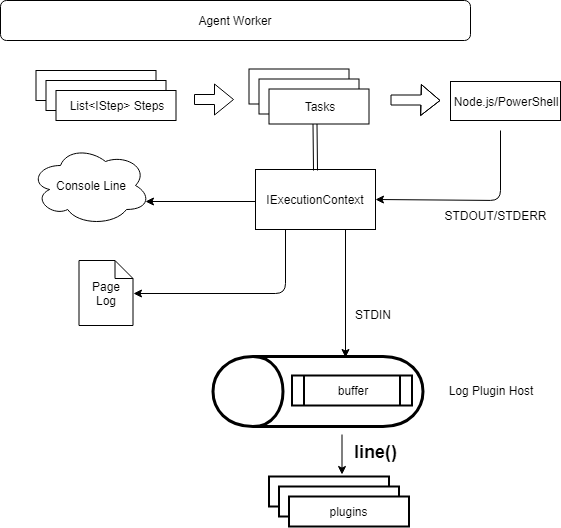

# Agent Log Processors RFC

## Goals

Provide an extensibility mechanism which offers other teams and partners to do additional processing on log output cooperatively as part of the job (as opposed to post job log processing).

Performance and reliability will be critical.  

## Scenarios 

### Publishing Test Results

In addition to our tasks, testing tools can be invoked from command lines and 
Scan the output looking for well known output patterns and publish test results to our test management service.  In addition many test frameworks do not have reporters by default.

These test tools can be called from our tasks but also via command lines and scripts such as powershell, shellscripts, python, javascript or any scripting technology.  They can also be called via `npm test` which is simply an indirection to a set of cmd lines and script calls. 

### Telemetry on Tool Usage

It is useful to know the usage and trends of certain scenarios being leverage via Azure Pipelines.  For example, we may want to know the numbers and trends of packages published to npm or nuget, docker images published or kubernetes configurations applied using our pipelines.

Once again, these may be called via tasks, cmd lines, scripts and even runners like `npm run publish`.

### Send Output to Another Service

Output could be processed and sent to another service for storage and processing.

## Log Processing Plugins

We will introduce a log processing plugins very similar to other agent plugins.

Currently the task handlers output is sent to a command pluging if the line starts with ##vso.  Else, it's passed to the agents logger which sends to the live console circular buffer and permanent log storage in pages.

In a companion out of proc log processing extensibility point, output can be processed in parallel with our log processing.  It will not block our live console and log publishing.

Not keeping up with stdin can cause it to fail.  In order to avoid having every plugin to get that right (and to reduce risk), we will create one log processing host which buffers

## Log Processing Host

To ensure log processing plugins do not block stdin, the host will take care of buffering output, processing that buffer or queue of log lines and processing that queue.  As it's processed each plugin will be called

## Lifetime

TODO

## Scope and Delivery

Initially this will be first party plugins packaged with the agent.  Eventually, this may be opened to external third party plugins.  Achieving that would require service side features to deliver as an extension.  It would also introduce another compatibility issue moving independently of the agent.

## Circuit Breaking

TODO

## Telemetry

TODO

